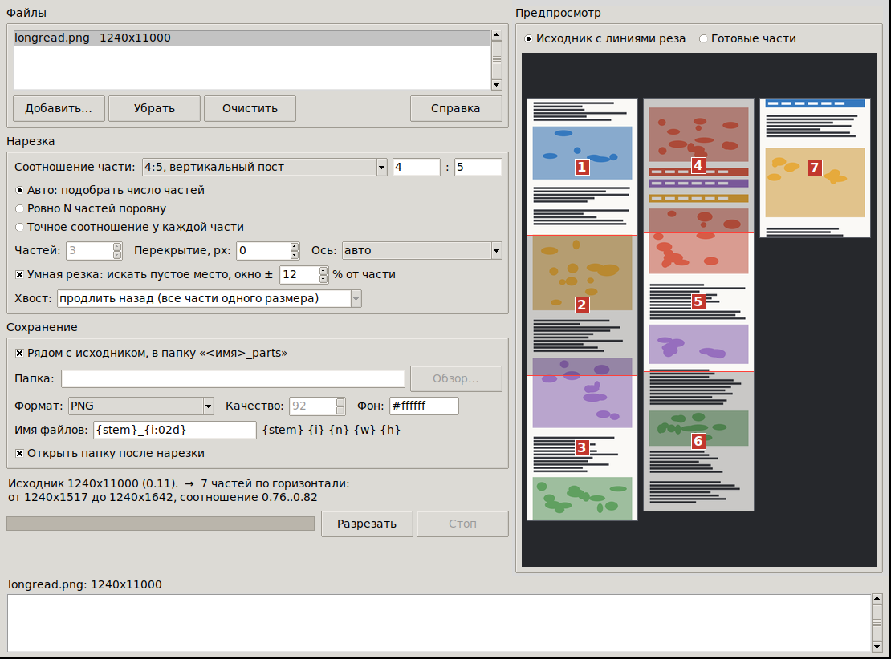
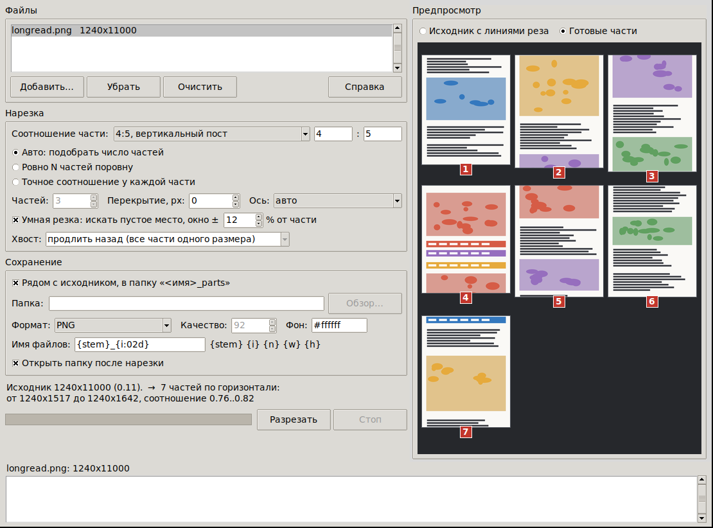

# Разрезалка длинных картинок

Небольшая программа под Windows 7-11: берёт картинку с неудобным соотношением
сторон (1240 × 11000 и подобные простыни) и режет её на несколько частей с
нормальным соотношением: 4:5, 1:1, 3:4, любым заданным.



## Что умеет

* **Считает сама.** Указываете, какое соотношение сторон нужно у частей,
  программа подбирает, на сколько кусков делить, чтобы каждый оказался как можно
  ближе к нему. 1240 × 11000 при цели 4:5 → 7 частей примерно по 1240 × 1570.
* **Умная резка.** Вместо того чтобы резать строго по расчётной линии, ищет
  рядом самую «спокойную» строку пикселей: пустоту между абзацами, однотонную
  полосу фона. Рез реже проходит по тексту и лицам. Радиус поиска настраивается.
* **Перекрытие.** Соседние части могут брать друг у друга 50-100 px, чтобы
  строка на границе целиком попала в обе.
* **Три режима:** авто, ровно N частей поровну, строго заданный размер каждой
  части (с выбором, что делать с остатком: продлить, оставить, дополнить фоном
  или отбросить).
* **Широкие картинки** режет вертикально, определяя направление само.
* **Предпросмотр**: либо исходник с линиями реза, либо готовые части сеткой.
  Длинная простыня раскладывается в несколько колонок, а не в волосок шириной
  в полсантиметра.
* **Пакетная обработка**: список файлов, прогресс, кнопка «Стоп».
* **Форматы**: PNG, JPEG, WEBP или как у исходника; качество, фон под
  прозрачностью, шаблон имени файлов.
* Настройки запоминаются между запусками.



## Быстрый старт

### Готовый .exe

1. Собрать: запустить `build_exe.bat` (или `build_exe_win7.bat` для Windows 7).
2. Взять `dist\ImageSplitter.exe`, это один файл, Python на целевой машине не нужен.

### Из исходников

```
python -m pip install -r requirements.txt
python main.py
```

или двойным щелчком по `run.bat`.

## Как это работает

Программа считает «номинальный» размер части: для вертикальной резки это
`ширина × (высота_соотношения / ширина_соотношения)`. Для 1240 px и цели 4:5 это
1550 px. Дальше:

| Режим | Что делает |
|---|---|
| **Авто** | `число частей = round(длина / номинал)`, затем делит поровну. Все части одинаковые, ничего не теряется, соотношение слегка «плавает» вокруг цели. |
| **Ровно N частей** | Делит поровну на заданное число. Соотношение получится какое получится. |
| **Точное соотношение** | Каждая часть ровно номинального размера, остаток обрабатывается по выбору. Умная резка в этом режиме выключается: она сдвигала бы границы и размеры перестали бы быть одинаковыми. |

Умная резка строит профиль «активности» по строкам: насколько строка отличается
от предыдущей плюс насколько она сама неоднородна. Ноль означает ровный фон.
Потом каждая расчётная линия сдвигается на самую спокойную строку в пределах
окна поиска; при равных кандидатах выигрывает ближний, так что линия не уезжает
без причины. Профиль считается средствами Pillow, поэтому картинка на 100 000 px
в высоту обрабатывается за доли секунды.

## Командная строка

Тот же движок без GUI, удобно для пакетной обработки:

```
python main.py longread.png --dry-run              # показать план, ничего не писать
python main.py *.png -r 4:5 -f jpeg -q 90
python main.py banner.png -r 1:1 -m exact --tail pad --background "#101010"
python main.py strip.png -m count -n 5 --overlap 80 -o C:\out
```

| Ключ | Смысл |
|---|---|
| `-r, --ratio` | соотношение части, `4:5`, `1:1`, `0.8` |
| `-m, --mode` | `auto` (по умолчанию), `count`, `exact` |
| `-n, --count` | число частей для `--mode count` |
| `--overlap` | перекрытие в пикселях |
| `--no-smart`, `--window N` | отключить умную резку / радиус поиска в % |
| `--tail` | `extend`, `keep`, `pad`, `drop` |
| `--axis` | `auto`, `y` (горизонтальные полосы), `x` (вертикальные) |
| `-o, --out` | папка вывода (по умолчанию `<имя>_parts` рядом с исходником) |
| `-f, --format`, `-q, --quality` | формат и качество |
| `--pattern` | имя файлов, токены `{stem} {i} {n} {w} {h}` |
| `--dry-run` | напечатать план и выйти |

## Совместимость

| Windows | Python | Pillow | Сборка |
|---|---|---|---|
| 8, 8.1, 10, 11 | любой 3.9+ | свежая | `build_exe.bat` |
| 7 SP1 | **3.8.10** последний, который туда ставится | **10.4.0** последний с поддержкой 3.8 | `build_exe_win7.bat` (PyInstaller 5.13.2) |

Код написан под Python 3.8 и не использует более поздний синтаксис. Кроме Pillow
зависимостей нет, GUI на штатном tkinter. Если дополнительно поставить
`tkinterdnd2`, заработает перетаскивание файлов мышью; без него всё работает
через кнопку «Добавить».

Ограничение Pillow на размер картинки поднято до 1 гигапикселя (по умолчанию оно
около 178 мегапикселей и такие простыни просто не открываются).

## Структура

```
main.py                    точка входа: без аргументов GUI, с аргументами CLI
image_splitter/core.py     вся математика: план резов, профиль активности, запись
image_splitter/preview.py  отрисовка предпросмотра (Pillow, без Tk)
image_splitter/gui.py      окно на tkinter
image_splitter/cli.py      разбор аргументов
assets/                    иконка и скрипт, который её генерирует
tests/test_core.py         36 тестов на логику и на запись файлов
```

Тесты:

```
python -m unittest discover -s tests -t .
```

## Горячие клавиши

`Ctrl+O` добавить файлы, `Delete` убрать выбранное, `F5` пересчитать план,
`Ctrl+Enter` разрезать.
